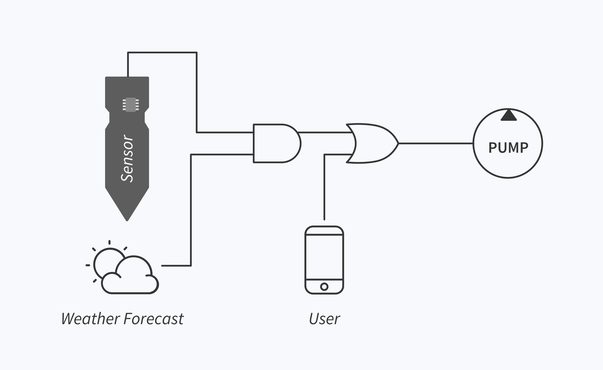
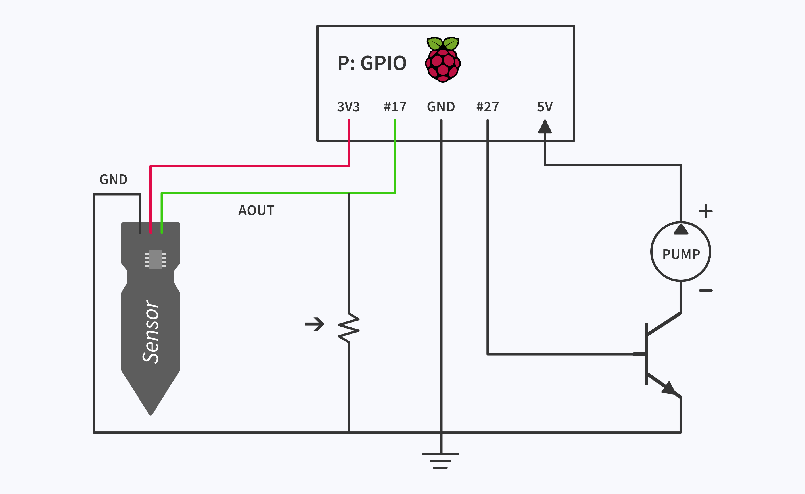
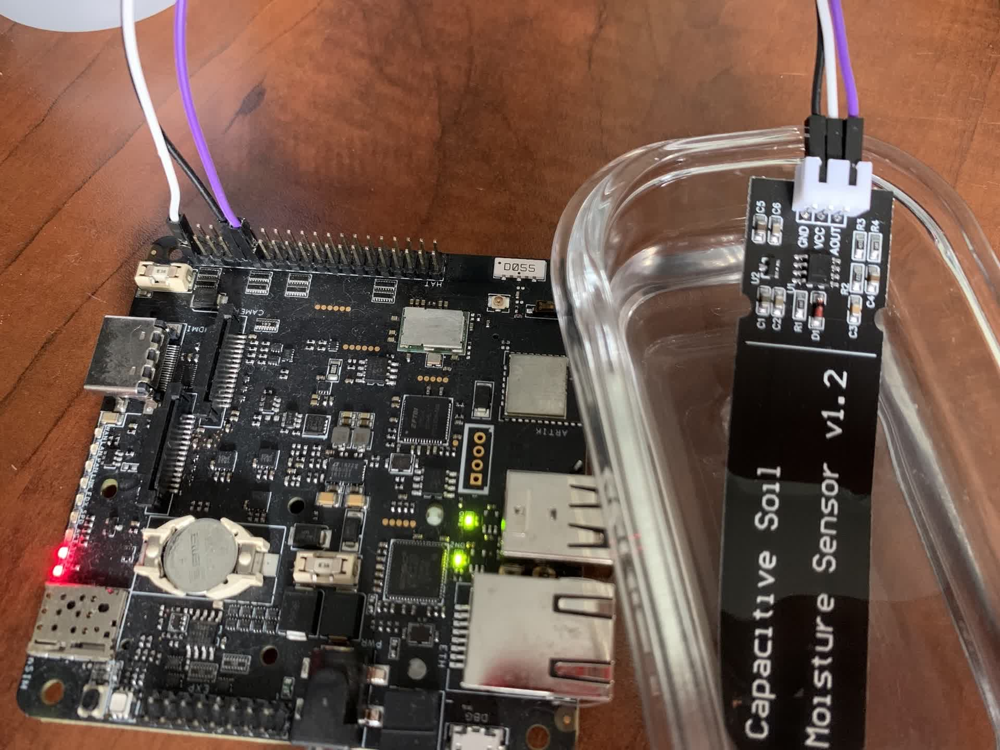
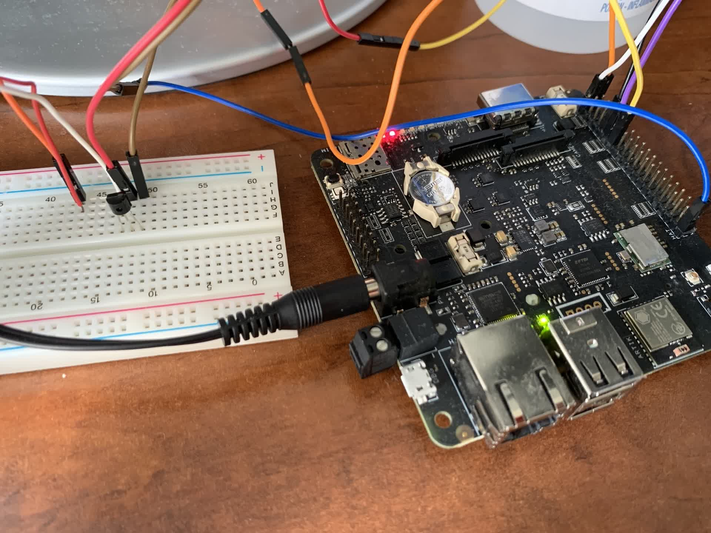
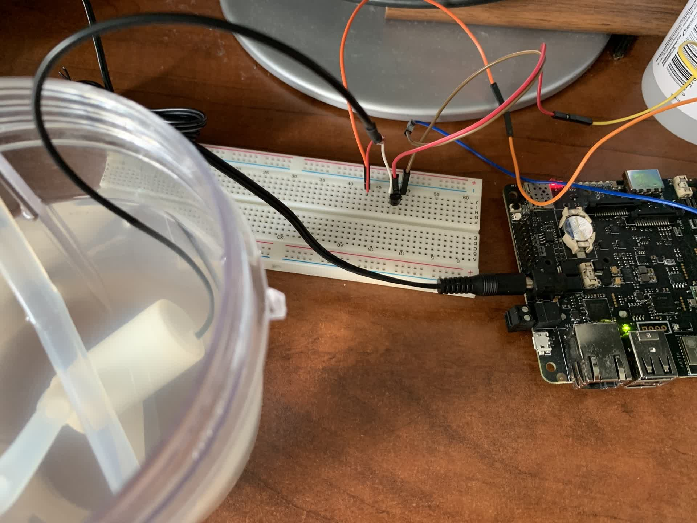

## Balena Plant II
>_disclaimer_: this is not an upgraded version of the [Balena Plant](https://github.com/balenalabs-incubator/balena-plant-saver). This project is an example of an application that can be built using just a few blocks in an industrial setting. The plant-watering solution is just one of the possible applications.

### Hardware required:
- [Raspberry Pi](https://www.aliexpress.com/item/4000130040254.html?key=a7e37b5f6ff1de9cb410158b1013e54a&prodOvrd=RAC&opt=false&aff_fcid=4d2d920f11ef4078804fb898b3aa854b-1638805157605-08626-_9xk30H&tt=CPS_NORMAL&aff_fsk=_9xk30H&aff_platform=shareComponent-detail&sk=_9xk30H&aff_trace_key=4d2d920f11ef4078804fb898b3aa854b-1638805157605-08626-_9xk30H&terminal_id=5408ef9d287140f483e79c70c12dadf0)
- [Moisture Sensor](https://www.aliexpress.com/item/4001131897353.html?key=a7e37b5f6ff1de9cb410158b1013e54a&prodOvrd=RAC&opt=false&aff_fcid=67008a4a793f486883b619d4ddb91236-1638805191877-02048-_AMDlxF&tt=CPS_NORMAL&aff_fsk=_AMDlxF&aff_platform=shareComponent-detail&sk=_AMDlxF&aff_trace_key=67008a4a793f486883b619d4ddb91236-1638805191877-02048-_AMDlxF&terminal_id=5408ef9d287140f483e79c70c12dadf0)
- [Water pump](https://www.aliexpress.com/item/1005001474769893.html?key=a7e37b5f6ff1de9cb410158b1013e54a&prodOvrd=RAC&opt=false&aff_fcid=b560a26c10cd4da99ef404cb90c875e6-1638805210860-08192-_Ab3k6N&tt=CPS_NORMAL&aff_fsk=_Ab3k6N&aff_platform=shareComponent-detail&sk=_Ab3k6N&aff_trace_key=b560a26c10cd4da99ef404cb90c875e6-1638805210860-08192-_Ab3k6N&terminal_id=5408ef9d287140f483e79c70c12dadf0)
- [NPN Transistor](https://www.aliexpress.com/item/32890015211.html?key=a7e37b5f6ff1de9cb410158b1013e54a&prodOvrd=RAC&opt=false&aff_fcid=8db9f890ee8244c4ae40388436a37575-1638805238863-07764-_9h0Net&tt=CPS_NORMAL&aff_fsk=_9h0Net&aff_platform=shareComponent-detail&sk=_9h0Net&aff_trace_key=8db9f890ee8244c4ae40388436a37575-1638805238863-07764-_9h0Net&terminal_id=5408ef9d287140f483e79c70c12dadf0)
- [Tubing](https://www.aliexpress.com/item/32730855848.html?key=a7e37b5f6ff1de9cb410158b1013e54a&prodOvrd=RAC&opt=false&aff_fcid=86bb3b0ed6fc4d71b96ee5d604e54f8f-1638805258012-04631-_A2CRiv&tt=CPS_NORMAL&aff_fsk=_A2CRiv&aff_platform=shareComponent-detail&sk=_A2CRiv&aff_trace_key=86bb3b0ed6fc4d71b96ee5d604e54f8f-1638805258012-04631-_A2CRiv&terminal_id=5408ef9d287140f483e79c70c12dadf0)
- [Potentiometer](https://www.aliexpress.com/item/1005002292828444.html?aff_fcid=751e5eb8689c421b97026cbcb507344a-1638815095748-02072-_9JRz1i&tt=CPS_NORMAL&aff_fsk=_9JRz1i&aff_platform=shareComponent-detail&sk=_9JRz1i&aff_trace_key=751e5eb8689c421b97026cbcb507344a-1638815095748-02072-_9JRz1i&terminal_id=5408ef9d287140f483e79c70c12dadf0) (optional)

### Deploying

[](https://dashboard.balena-cloud.com/deploy?repoUrl=https://github.com/builder555/balena-plant-2)

If you don't already have have an account, follow the [Getting Started Guide](https://www.balena.io/docs/learn/getting-started).

## Intro

The purpose of this project is to build a prototype of a basic industrial control system. A good example application that demonstrates most of the components is a plant-watering device. The application consists of [Blocks](https://www.balena.io/docs/learn/more/examples/balenablocks/) that use MQTT for communication. The system includes a sensor, a motor, an API, and a user input connected through logic blocks. 

The moisture sensor takes soil readings and provides a "dry/wet" signal to the Pi. The application checks the forecast for the next 24 hours and based on the two inputs either sends the signal to start or stop the pump. The user also has the ability to override the signals from the sensor and the API and manually turn on the pump.

## Software

The application logic:



Each component in the diagram is its own block. The AND and OR gates are simple python containers that take binary inputs and produce binary output. These blocks can be combined into digital circuits of arbitrary complexity. Other blocks can be added to increase inputs or outputs. The commands from the user/ui are sent using web sockets.

## Assembly

Schematic:



The optional potentiometer can be used to adjust the sensitivity of the moisture sensor. The capacitive sensor is rated to provide a 0-3V, with 3V being "dry" and 0V - "wet". In reality the output ranges from 0.25V to about 2.7V. The threshold voltage on the Pi GPIO is around 1.3V. The GPIO pins have internal pull-up resistors (around 50k) that can be enabled; if you use them, then you'll need to adjust the potentiometer to a lower value to trigger the "dry" status. If you use a pump that draws a lot of power, use a relay instead of a BJT.

The pump runs for 30s at a time, then cools down for 30s. More details about the cooldown values can be found in the [basic-motor block](https://github.com/builder555/balena-basic-motor).

The assembly looks something like this:








## Development

To deploy manually or debug the application, you'll need to have [balena cli](https://www.balena.io/docs/reference/balena-cli/) installed.

```bash
git clone https://github.com/builder555/balena-plant-2
cd balena-plant-2
balena push <your_device_id>.local
```


There is a more extensive write-up with some background on [balena forum](https://forums.balena.io/t/industrial-controls-using-plant-waterer-as-a-prototype/344642), if you're curious.

---

_logo image by [iconfield](https://thenounproject.com/iconfield)_
